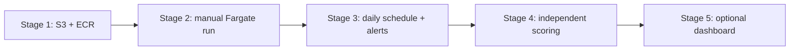

# AWS deployment plan

This is the beginner-friendly, staged path for deploying the forecasting system. The guiding rule is simple: prove one small piece at a time, observe its cost and behavior, and only then enable the next piece.

No step in this document requires automatic retraining, automatic model selection, load balancing, or an always-on web server.

## The small AWS vocabulary

| Term | Plain-language meaning | Use in this project |
|---|---|---|
| AWS account | The billing and security boundary for all cloud resources | You create and own this |
| Region | The physical AWS area where resources live | `eu-central-1` (Frankfurt) |
| IAM | Permissions: who or what may do an action | Gives Terraform and containers narrowly scoped access |
| AWS CLI | Commands issued from your terminal to AWS | Authentication, uploads, and inspection |
| Terraform | Code describing cloud resources | Makes infrastructure repeatable and reviewable |
| S3 | Durable object/file storage | Model, data state, immutable forecast runs, and `latest.json` |
| ECR | Private storage for Docker images | Stores the pipeline container |
| Docker image | A packaged application and its dependencies | Ensures the same code runs locally and in AWS |
| ECS | AWS service that starts and supervises containers | Holds the task definition |
| Fargate | Runs an ECS container without managing a server | Executes one forecast job and then stops |
| CloudWatch | Logs, metrics, and alarms | Shows what happened and alerts on failures |
| EventBridge Scheduler | A cloud alarm clock | Starts the pipeline daily only when enabled |
| SNS | Notification delivery | Sends optional operational email alerts |
| ALB / CloudFront | Web traffic routing and delivery | Deferred with the dashboard; not needed for forecasting |
| GitHub OIDC | Short-lived AWS login for GitHub Actions | Used for the initial image upload; a permanent deploy role remains deferred |

## Architecture by stage



## Current deployment status (2026-07-14)

Stages 0–2 are complete in the production account in region `eu-central-1`:

- Terraform state is versioned, encrypted, publicly blocked, and natively
  locked in the dedicated state bucket.
- The private artifact bucket and immutable pipeline ECR repository exist.
- Pipeline image commit `65a4ae25842ceb27df2913769916c21b85c971c9`
  is deployed as ECS task definition revision 1.
- Pipeline scheduling, independent scoring, alerts, and the always-on
  Streamlit tier remain disabled. No ECS service or EventBridge schedule is
  running.
- Historical replay `replay_20260713T211418Z` completed with exit code 0. It
  published 48 ordered, finite Chronos forecasts (24 each for DK1 and DK2) to
  the isolated `dk-energy-forecasts/smoke` sub-prefix. Artifact hashes match,
  and neither the smoke nor production root contains `latest.json`.
- A static replay dashboard is live from the dedicated public site bucket at
  `http://dk-energy-forecasts-site-653044339519.s3-website.eu-central-1.amazonaws.com/`.
  The public bucket contains only `index.html`; the model and pipeline artifacts
  remain in the separate private bucket.
- CloudFront creation was attempted but AWS rejected it until the new account
  is verified. The temporary origin access control was removed cleanly. The S3
  website is the intentional HTTP-only MVP until that account restriction is
  lifted.
- The pipeline Dockerfile now pins Python 3.11.15 on Debian 12 Bookworm by
  multi-platform digest. The Linux x86-64 image builds and imports the complete
  Chronos runtime as non-root UID 10001. An ECR base-image comparison reduced
  the scanner result from 2 critical / 7 high findings on Debian 13 to 1
  critical / 4 high on Bookworm. All five remaining findings are in Perl and
  AWS reports no fixed package version. The pinned image becomes active on the
  next task-definition deployment; the successful replay remains reproducible
  from its original image SHA.

The next forecasting gate is one manual **live** run started before the
Copenhagen noon deadline. Do not enable Stage 3 scheduling until that run and
its production `latest.json` have been inspected. The public demonstration no
longer depends on that gate because it is explicitly labelled as a replay.

## Stage 0 — account safety and local tools

Cost: **no workload cost**.

Actions that require you:

1. Create the AWS account and enable MFA on its root user.
2. Do not use the root user for routine work. In this standalone account, create the
   `peter-admin` IAM user, require MFA, and do not create access keys.
3. Give `peter-admin` console access plus the AWS-managed `AdministratorAccess`,
   `IAMUserChangePassword`, and `SignInLocalDevelopmentAccess` policies. The broad
   administrator policy is acceptable for this first, owner-operated deployment;
   replace it with least-privilege roles after the infrastructure is understood.
4. Sign in as `peter-admin`, change the temporary password, and configure its MFA.
   Reserve the root login for account-level emergencies.
5. Select `eu-central-1` consistently and authenticate the CLI with temporary,
   browser-issued credentials:

   ```bash
   aws configure set region eu-central-1 --profile dkenergy-production
   aws login --profile dkenergy-production
   AWS_PROFILE=dkenergy-production aws sts get-caller-identity
   ```

   The final ARN must end in `user/peter-admin`, not `root`.
   Some SDK-based tools do not yet read the new `aws login` cache directly.
   Configure a second, non-secret profile that asks the AWS CLI for the same
   temporary session:

   ```bash
   aws configure set credential_process \
     "aws configure export-credentials --profile dkenergy-production --format process" \
     --profile dkenergy-terraform
   aws configure set region eu-central-1 --profile dkenergy-terraform
   AWS_PROFILE=dkenergy-terraform aws sts get-caller-identity
   ```

   Use `dkenergy-production` for direct AWS CLI commands and
   `dkenergy-terraform` for Terraform. Neither profile contains long-lived
   access keys.
6. Create AWS Budget alerts at small thresholds such as EUR 5, 15, and 30. A budget is an alert, not a hard spending cap.
7. Never paste passwords, access keys, login URLs, or session credentials into this repository.

Local project setup:

```bash
python3 -m venv .venv
.venv/bin/python -m pip install -e ".[dev,app,aws]"
.venv/bin/python -m pytest
```

Before any apply, read the plan. A saved plan makes approval explicit:

```bash
terraform -chdir=infra/aws plan -out=deployment.tfplan
terraform -chdir=infra/aws show deployment.tfplan
terraform -chdir=infra/aws apply deployment.tfplan
```

## Stage 1 — storage only

Expected cost: roughly **EUR 1–5/month** at this project's scale, depending mainly on stored model/image size. Confirm with the AWS Pricing Calculator before applying.

Create only:

- a small S3 bucket for Terraform state;
- the application's versioned, encrypted S3 artifact bucket;
- the pipeline ECR repository.

Do not create compute, schedules, the web service, an ALB, or CloudFront. Upload the immutable Chronos artifact selected in `config/production.json`, build the pipeline image, and push it using a Git commit SHA as its immutable tag.

The current stack is one Terraform root, so Stage 1 is the one deliberate use
of targeted apply. Save and inspect this bootstrap plan first; all later stages
return to ordinary, complete plans:

```bash
terraform -chdir=infra/aws plan -out=storage.tfplan \
  -target=aws_s3_bucket.artifacts \
  -target=aws_s3_bucket_public_access_block.artifacts \
  -target=aws_s3_bucket_versioning.artifacts \
  -target=aws_s3_bucket_server_side_encryption_configuration.artifacts \
  -target=aws_ecr_repository.pipeline \
  -target=aws_ecr_lifecycle_policy.pipeline
terraform -chdir=infra/aws show storage.tfplan
terraform -chdir=infra/aws apply storage.tfplan
```

Terraform's own state bucket is a separate one-time bootstrap resource and is
not managed by this stack, because a state bucket cannot store the plan that
creates itself.

Validate the artifact before upload:

```bash
.venv/bin/python -c "from dkenergy_forecast.models.chronos_production import load_lora_artifact_manifest; load_lora_artifact_manifest('artifacts/models/chronos_weather/sha256-55814a7fd0d36973'); print('valid')"
```

The current Terraform defaults keep `enable_web`, `enable_pipeline_schedule`,
and `enable_published_scoring_schedule` false. With those flags disabled,
Terraform creates only the manual pipeline runtime: it does not create the
scoring task, Scheduler roles, EventBridge rules, SNS topic, deadline-check
Lambda, alarms, or web resources.

### Do we retrain Chronos first?

No. The first deployment uses the already trained immutable release
`sha256-55814a7fd0d36973`. Its manifest, file checksums, Chronos version, PEFT
version, PyTorch version, weather contract, and target contract are validated
before upload. Retraining now would add a second moving part without teaching
us anything about whether the deployment works.

Retrain only when diagnostics provide a reason, or when intentionally testing
a changed training dataset, feature contract, base-model revision, or training
recipe. A new training run must produce a new immutable release ID and pass the
same validation before `config/production.json` is changed.

### What is built now?

Build the pipeline image after tests pass. The image contains the application
and CPU-only inference dependencies; it deliberately does not contain the LoRA
artifact or base Chronos weights. The task downloads the small LoRA artifact
from S3 and the pinned base-model revision through the model loader. GitHub
Actions builds the deployment image for Linux x86-64 and tags it with the Git
commit SHA. Do not deploy the local `:local` smoke-test tag.

## Stage 2 — one manual forecast task

Expected cost: **pennies to about EUR 1 per run**, depending on duration and requested Fargate CPU/memory. The task stops when the command finishes.

Add the ECS cluster, task definition, task IAM roles, network, and CloudWatch logs. Keep every schedule and the web tier disabled.

First run a historical replay. Give it a separate sub-prefix inside the
pipeline's permitted artifact prefix, for example
`s3://BUCKET/dk-energy-forecasts/smoke`, and pass:

```text
pipeline --artifact-store-uri s3://BUCKET/dk-energy-forecasts/smoke \
  --model-artifact-uri s3://BUCKET/dk-energy-forecasts/models/chronos_weather/sha256-55814a7fd0d36973 \
  --run-kind replay \
  --information-cutoff-utc 2026-07-01T08:00:00Z
```

The separate sub-prefix is the safety boundary: replay state and immutable run
artifacts cannot replace production state. Replay deliberately does not write a
`latest.json` pointer, while the task's least-privilege S3 policy still permits
access. Inspect CloudWatch logs and the S3 objects.
Verify the run receipt, delivery-date row counts (23/24/25 hours as
appropriate), model release ID, weather mode, quantile ordering, and completion
marker.

Then run one live task manually before the Copenhagen noon publication deadline. Verify that the immutable run uploads first, `COMPLETED.json` follows, and the root `latest.json` pointer is written last.

## Stage 3 — daily production

Expected cost: roughly **EUR 5–20/month**, highly dependent on task runtime. Observe actual billing rather than relying on the estimate.

Set only `enable_pipeline_schedule=true`. Keep web and independent scoring off. Configure an email endpoint for alerts, confirm the SNS subscription, and retain the deadline check. Observe at least seven daily runs before adding anything else:

- task starts at the intended Copenhagen time, including after a DST transition;
- publication completes before noon;
- logs contain no silent fallback or stale-weather warning;
- S3 growth and Fargate runtime match expectations;
- the AWS Cost Explorer total matches the budget.

## Stage 4 — diagnostics in the background

Expected incremental cost: roughly **EUR 1–10/month**.

Set `enable_published_scoring_schedule=true` only after daily forecasting is stable. Scoring reads saved forecasts after outcomes arrive and writes diagnostics independently. Its failure must never block or alter live publication.

This stage does **not** retrain Chronos and does not select or promote a champion.

## Stage 5 — optional public dashboard

The first public portfolio view is a self-contained HTML export in a dedicated
S3 website bucket. It has no server process and effectively no idle compute
cost. Build it with `scripts/build_static_dashboard.py` or `make
static-dashboard`, then upload `index.html` to the `static_site_s3_uri`
Terraform output.

Keep `enable_static_site=true` (or the GitHub environment variable
`ENABLE_STATIC_SITE=true`) in later full-stack Terraform applies. Setting the
feature flag back to false intentionally removes the site infrastructure.

The MVP endpoint is HTTP-only. Once AWS verifies the account for new CloudFront
resources, put CloudFront in front of the private/static origin to add HTTPS and
caching. This upgrade does not require moving to an application server.

The existing Streamlit/Fargate/ALB/CloudFront path is retained but opt-in through `enable_web=true`. Treat it as a later choice: an always-on Fargate task, public IPv4 addresses, and an ALB can plausibly cost **EUR 50–100/month** before meaningful traffic. Calculate it for the chosen region before enabling it.

## Explicitly deferred

- automatic Chronos retraining;
- champion selection and automatic promotion;
- multiple service replicas, autoscaling, and load balancing;
- Kubernetes, a database, a feature store, WAF, and a custom domain;
- GitHub-driven deployment until the first local deployment is understood.

These can be reconsidered only when an observed problem justifies their complexity.

## How we deploy together

1. **Account session:** you create and secure the account; we verify identity and budgets without applying application infrastructure.
2. **Storage session:** we inspect a Stage 1 Terraform plan line by line, then you approve the apply.
3. **Image session:** we build, validate, scan, and push the pipeline image and model artifact.
4. **Manual-run session:** we execute a replay in the isolated smoke prefix, inspect every output, and then perform one live run.
5. **Scheduling session:** after the manual evidence is satisfactory, we enable the daily schedule and alarms.
6. **Automation session:** only later, replace local credentials with GitHub OIDC and keep the workflow manually triggered until it has earned trust.

At every session, `terraform plan` is the proposed change, `terraform apply` is the action, and `terraform destroy` removes Terraform-managed resources. Never apply a plan you do not understand.
