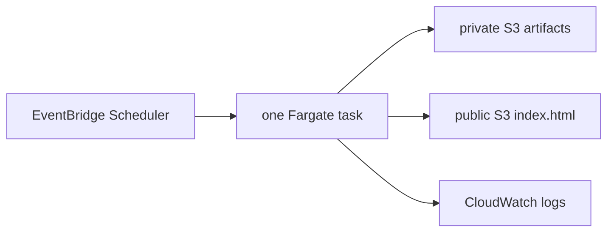

# Staged AWS deployment plan

## The problem and the chosen solution

The project needs to do two things once per day: produce a trustworthy forecast
artifact and publish a useful analytical page. Neither requirement needs a
permanent server.

The chosen architecture starts one container at 10:00 Copenhagen time. The
container fetches data, builds features, runs the fixed Chronos release (or its
fixed fallback), saves an immutable forecast, updates 30-day diagnostics, builds
one HTML file, uploads it, and exits.

This is the smallest architecture that automates the real product. It avoids an
always-on Streamlit process, ALB, CloudFront, database, automatic retraining,
load balancing, and model promotion.

## Stage 0 — local and account foundations

Complete once:

- AWS account and budget alerts;
- non-root administrator identity with MFA;
- AWS CLI profile in `eu-central-1`;
- Docker and Terraform installed;
- separate encrypted/versioned Terraform-state bucket;
- full local tests and a visually accepted static page.

Root credentials are for account recovery and exceptional account tasks, not
daily CLI work.

## Stage 1 — storage and a manual static page

Terraform creates:

- the private artifact bucket;
- the public static-site bucket;
- the pipeline ECR repository.

Upload the reviewed LoRA artifact to its content-addressed private prefix. Build
the dashboard locally, seed its private history from existing evaluation
artifacts, and upload `index.html` manually.

Success means the website endpoint displays the expected DK1/DK2 page and no
compute is running.

## Stage 2 — manual batch execution

Build one pipeline image tagged with the full Git SHA, push it to ECR, and apply
Terraform with the daily schedule disabled. Start exactly one ECS task manually.

Verify:

1. the task uses the expected image digest and Git revision;
2. it exits zero;
3. a new immutable run contains predictions, diagnostics, manifest, and
   completion receipt;
4. `latest.json` points to that run and was uploaded last;
5. private dashboard history has been refreshed;
6. public `index.html` was replaced and has the correct content type;
7. Chronos or an explicitly marked degraded fallback is visible.

The static build must also prove that DK1 and DK2 both have their complete
DST-aware hourly grid and an explicit model release ID. The evaluated and
forecast sides may be joined only for consecutive local dates from that same
release. Missing compatible history yields a forecast-only page; malformed
compatible history blocks the public upload and preserves the preceding
`index.html`. The registered private forecast remains archived either way.

If static rendering fails after forecast publication, the previous page should
remain public and the new forecast should remain valid.

## Stage 3 — one daily schedule

Enable only `enable_pipeline_schedule=true`. The default is 10:00 in the
`Europe/Copenhagen` timezone, leaving headroom before the local noon publication
deadline.

Observe at least seven runs. During this stage, operational monitoring is
deliberately manual and simple:

- check the ECS task exit code;
- check the CloudWatch log stream;
- check the timestamp/delivery date in `latest.json` and on the public page.

Do not add retries that could publish late. A missing day in an early portfolio
project is preferable to silently violating the forecast cutoff.

## Stage 4 — background scoring

The public page already calculates rolling metrics from registered diagnostic
forecasts. The repository also supports deeper independent scoring of immutable
published runs.

Only after the daily task is stable, decide whether a second cheap scheduled
task is useful. Its outputs must remain diagnostic: a scoring failure must not
alter `latest.json`, the configured model, or the published forecast.

## Stage 5 — HTTPS and a friendly domain

The initial S3 website is public HTTP. When the page is worth sharing more
broadly, add CloudFront with origin access control in front of a private S3
origin, then optionally Route 53 and an ACM certificate.

This is a delivery/security improvement, not a forecasting requirement. Add it
after the batch product is stable.

## Explicitly deferred

- automatic LoRA retraining;
- tuning jobs;
- champion/challenger promotion;
- a feature store or database;
- an always-on web application;
- load balancing and autoscaling;
- a Lambda deadline checker;
- broad alerting infrastructure.

Each deferred component must justify its cost and conceptual weight against a
specific observed problem.

## Cost shape

The static bucket incurs tiny storage/request charges. ECR stores a handful of
images. Fargate charges only while the daily task is running. There is no
24-hour compute or load balancer charge. Data transfer and request volume are
small for a portfolio dashboard.

Review the current AWS pricing pages before changing regions or adding HTTPS,
but the dominant early cost should be one short Fargate run per day.

## Rollback

- **Bad page:** restore the previous version of `index.html` from S3 versioning.
- **Bad container:** apply the previous immutable image URI/task revision.
- **Bad schedule:** set `enable_pipeline_schedule=false`.
- **Bad forecast release:** point `config/production.json` at the previous
  immutable adapter, build a new Git revision/image, test manually, then apply.
- **Infrastructure surprise:** do not apply; inspect the saved Terraform plan.

Rollback never edits an existing immutable forecast run or model directory.
