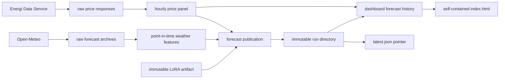

# Codebase tour

This document explains the project from first principles. Read it once from top
to bottom before changing the production path; later, use the links as a map.

## 1. What problem does the repository solve?

Denmark has two electricity bidding zones, DK1 and DK2. For every local hour of
tomorrow, the project predicts the day-ahead electricity price in DKK/MWh. A
normal day contains 24 hours, but daylight-saving transitions contain 23 or 25.
That small detail is representative of the project: the model matters, but the
time and data contracts matter just as much.

The daily result is not merely an array of numbers. A useful forecast must say:

- which delivery hour and price area each number describes;
- what information was available when it was made;
- which immutable model release produced it;
- whether the primary model or fallback was used;
- whether the complete result was durably saved before its deadline;
- how recent registered forecasts performed once actual prices arrived.

The repository therefore combines a forecasting library, explicit file
contracts, a daily batch job, and a static analytical dashboard.

## 2. The central design idea: files are the interfaces

There is no production database. Each layer reads files with documented schemas
and writes new files. This makes an individual forecast easy to inspect and
keeps local analysis close to production behavior.



This does not mean “write arbitrary files anywhere.” Paths and schemas are
centralized, validation happens at boundaries, immutable run directories are
checksummed, and `COMPLETED.json` is a commit marker.

## 3. Three layers to keep in your head

### Library layer

Everything under `src/` should be importable and testable without running a
command-line program.

- [`src/dkenergy_data/`](../src/dkenergy_data/) talks to external data sources.
- [`src/dkenergy_forecast/features/`](../src/dkenergy_forecast/features/) builds
  leakage-safe model inputs.
- [`src/dkenergy_forecast/models/`](../src/dkenergy_forecast/models/) contains
  model implementations and the deliberately small registries.
- [`src/dkenergy_forecast/backtesting/`](../src/dkenergy_forecast/backtesting/)
  simulates forecasts at historical origins.
- [`src/dkenergy_forecast/evaluation/`](../src/dkenergy_forecast/evaluation/)
  calculates point and probabilistic metrics.
- [`src/dkenergy_forecast/publishing/`](../src/dkenergy_forecast/publishing/)
  defines durable run artifacts and publication rules.
- [`src/dkenergy_forecast/operations/`](../src/dkenergy_forecast/operations/)
  composes library pieces into daily actions.

### Command layer

Files under [`scripts/`](../scripts/) parse arguments, call library functions,
and print useful progress. Business logic should not accumulate here.

Examples:

- `fetch_eds_prices.py` invokes the price client;
- `build_price_panel.py` turns raw responses into the canonical panel;
- `run_publish_forecast.py` invokes the publication operation;
- `run_cloud_pipeline.py` adds S3 synchronization around the same daily path;
- `build_static_dashboard.py` produces a local static page.

### Infrastructure layer

[`infra/aws/`](../infra/aws/) declares the production machinery. It does not
implement forecasting. AWS starts the same container command that can be run
locally, gives it network and file access, and keeps its logs.

This separation is important: changing a chart should not alter model
selection; changing a model should not require a new web service; changing the
schedule should not duplicate the data pipeline.

## 4. Time semantics: the most important correctness topic

Four timestamps must not be conflated:

| Name | Meaning |
|---|---|
| `ds_utc` | The delivery hour being predicted |
| `forecast_origin_utc` | The formal origin associated with the forecast |
| `information_cutoff_utc` | The newest information the run may use |
| `decision_deadline_utc` | The latest time the durable publication may complete |

Local Copenhagen time is used for market-facing dates and schedules. UTC is
used for storage, ordering, joins, and comparison. Helpers in
[`types.py`](../src/dkenergy_forecast/types.py) normalize timestamps and enforce
this convention.

Price availability is explicit. A historical price row is usable only when its
availability timestamp is strictly earlier than the information cutoff. A row
being earlier in delivery time is not sufficient evidence that it was known.

The horizon builder in
[`backtesting/horizons.py`](../src/dkenergy_forecast/backtesting/horizons.py)
constructs the next Danish local delivery day, so DST days naturally yield the
correct 23, 24, or 25 hourly rows.

## 5. Data ingestion

### Prices

[`energidataservice.py`](../src/dkenergy_data/sources/energidataservice.py)
downloads Danish day-ahead prices. Raw responses are retained so normalization
can be repeated without another network request.

`build_price_panel.py` creates the canonical model-ready panel and a QA JSON
sidecar. The panel includes:

- UTC and local timestamps;
- area identifiers;
- target price `y`;
- calendar features;
- an explicit price-availability timestamp;
- dataset-version metadata.

The QA sidecar records coverage and whether the historical interval is final.
Production deliberately allows an incomplete recent edge because the newest
delivery day is still unfolding; historical evaluations can require a stricter
status.

### Weather

Open-Meteo “previous runs” are archived forecasts, not retrospective perfect
weather. [`open_meteo.py`](../src/dkenergy_data/sources/open_meteo.py) and the
weather build scripts preserve when each weather forecast became available.
For a historical origin, feature construction selects only the newest weather
run available before that origin.

The daily cloud task checks that the resulting weather artifact is recent. If
weather is missing or stale, Chronos cannot silently consume old covariates.

## 6. Features and leakage control

[`price_features.py`](../src/dkenergy_forecast/features/price_features.py) and
[`weather_features.py`](../src/dkenergy_forecast/features/weather_features.py)
contain reusable feature construction. Feature-set names are centralized in
[`feature_sets.py`](../src/dkenergy_forecast/features/feature_sets.py).

The main rule is simple: a feature for a forecast origin must be reproducible
using only information available before that origin. Backtests use the same
rule, so their scores are meaningful approximations of live performance.

## 7. Models: production is small, research remains rich

### Live publication

[`registry.py`](../src/dkenergy_forecast/models/registry.py) exposes exactly two
publication-capable models:

1. `chronos_weather` — the primary weather-aware Chronos-2 LoRA model;
2. `weighted_median_v1` — the fixed fallback.

[`config/production.json`](../config/production.json) names the adapter artifact
and these two roles. There is no champion ranking or automatic promotion.

The adapter directory has its own manifest and content digest. Loading checks
the contract before inference. A different adapter is a different release and
requires an explicit source-controlled configuration change.

### Dashboard diagnostics

Every daily publication also calculates three cheap baselines:

- the weighted median fallback;
- a 28-day local-hour rolling median;
- the same hour one week earlier.

They are written to `diagnostic_predictions.parquet` with the published model.
They never influence fallback choice or publication status. This gives the
public page honest comparisons without inventing an automated selection system.

### Research-only models

[`comparison_registry.py`](../src/dkenergy_forecast/models/comparison_registry.py)
exposes experimental CatBoost and zero-shot Chronos models. Their implementation
modules use “experimental” or “zero-shot” names. Notebooks can compare them,
but importing the main `models` package exposes only stable live-path concepts.

The large CatBoost validation module is retained because the development
notebook uses it. It is analytical code, not operational code. This distinction
is clearer and safer than deleting legitimate research or pretending it is in
production.

## 8. Backtesting and metrics

[`rolling_origin.py`](../src/dkenergy_forecast/backtesting/rolling_origin.py)
repeatedly asks, “What would this model have predicted using information
available at this historical origin?” It builds a training slice, constructs the
correct delivery horizon, fits a fresh model instance, and saves row-level
predictions.

Evaluation preserves row-level artifacts and derives summaries from them:

- MAE, RMSE, and bias for point forecasts;
- interval coverage and width;
- pinball losses and weighted interval score for probabilistic forecasts;
- stratified tables for hour, area, or other useful groups.

Keeping predictions is more valuable than keeping only a score: a strange
metric can be traced to the exact hours that produced it.

## 9. What happens during a daily run?

[`daily_pipeline.py`](../src/dkenergy_forecast/operations/daily_pipeline.py)
constructs the commands. [`cloud_pipeline.py`](../src/dkenergy_forecast/cloud_pipeline.py)
wraps them with private S3 state synchronization.

The live sequence is:

1. Download previous raw/model-ready state, completed forecast runs, the latest
   pointer, the small dashboard history, and the immutable LoRA artifact.
2. Fetch the recent price range and rebuild the canonical price panel.
3. Fetch archived weather forecasts and rebuild point-in-time weather features.
4. Validate weather freshness.
5. Run Chronos for tomorrow. If it fails for an expected operational reason,
   run the fixed weighted-median fallback.
6. Calculate the cheap diagnostic baselines.
7. Write the complete run to a temporary sibling directory.
8. Hash the files, write `manifest.json`, then write `COMPLETED.json`.
9. Atomically rename the temporary directory into its immutable run id.
10. Upload run files, upload `COMPLETED.json`, then update `latest.json` last.
11. Merge registered diagnostic predictions into the private dashboard history
    and fill newly available actual prices from the current panel.
12. Build a self-contained HTML page and replace public `index.html`.

Steps 11–12 happen after authoritative publication. If rendering fails, the
previous public page remains in S3 and the new forecast artifacts remain valid.

## 10. Publication as a small transaction

The code does not claim that S3 offers a multi-file database transaction.
Instead it implements a simple, inspectable commit protocol.

```text
forecast_runs/<run-id>/
├── predictions.parquet
├── diagnostic_predictions.parquet
├── model_scores.parquet
├── forecast_dashboard.json
├── manifest.json
└── COMPLETED.json

latest.json  ──points to──> forecast_runs/<run-id>/
```

Readers trust only a directory with a valid completion receipt. The mutable
pointer is written last. Reusing an idempotency key with different core artifact
hashes fails. A pointer cannot move backward to an older delivery date or older
cutoff for the same date.

“Latest pointer” is publication mechanics, not model promotion. It answers
“which complete forecast run is current?” rather than “which model won?”

## 11. The dashboard path

[`dashboard.py`](../src/dkenergy_forecast/dashboard.py) owns data preparation:

- stable model-family aliases;
- duplicate resolution;
- joining registered forecasts to official actuals;
- per-model 30-day windows;
- JSON-safe public records.

[`static_dashboard.py`](../src/dkenergy_forecast/static_dashboard.py) owns
the public-data contract and presentation. Before rendering, Python checks the
run delivery date, the presence of both DK1 and DK2, duplicate timestamps, each
complete DST-aware 23/24/25-hour grid, interval completeness and ordering, exact
previous-day adjacency, and explicit model-release identity. It then embeds the
already selected outlook rows, CSS, and JavaScript in one HTML document. The
browser does not guess which historical day belongs beside the forecast. There
are no remote JavaScript libraries, application APIs, cookies, or server-side
sessions.

The page shows:

- the last evaluated production day flowing into tomorrow’s forecast;
- matching markers for when the new forecast was made and when its delivery begins;
- distinct colours for the previous forecast being evaluated and the new forecast
  for tomorrow, with a full-width day-ahead-market explanation on the page;
- forecast timing and model identity inside the chart card instead of separate
  summary cards;
- uncertainty on both sides of the separator only when a complete interval is
  available on both sides;
- up to 30 evaluated days for Chronos and each baseline;
- MAE, RMSE, bias, and interval coverage where relevant;
- run provenance and hourly forecast values.

The private history retains 32 delivery dates per model/area so one or two
unevaluated forecasts survive while the public page selects 30 evaluated days.
Existing backtest rows can seed the archive once. Registered daily rows replace
them naturally. A seed row is eligible for the outlook only when it is exactly
one local day before the forecast and has the active release ID. Missing history
produces a forecast-only chart; incomplete adjacent history rejects the page
build and leaves the previous public file intact.

## 12. Storage abstraction

[`storage.py`](../src/dkenergy_forecast/storage.py) supports plain paths,
`file://`, and `s3://`. `ArtifactStore` intentionally exposes only a few
operations: exists, upload/download one file, and upload/download a prefix.

The local implementation makes cloud orchestration testable with temporary
directories. S3-specific metadata is used only when publishing `index.html` so
the browser receives the correct content type and short cache lifetime.
Optional S3 reads ignore only a genuine missing-object response; authentication,
authorization, and transport failures stop the run. Timestamped raw responses
are append-only, so an existing raw key is never uploaded as a new S3 version.

## 13. AWS architecture

Terraform creates:

- one private, encrypted, versioned artifact bucket;
- one private, encrypted, versioned S3 origin containing `index.html`;
- one CloudFront distribution providing HTTPS, compression, and short caching;
- one ECR repository retaining five recent images;
- one ECS cluster and Fargate task definition;
- two public subnets, an internet gateway, and an outbound-only task security
  group;
- one 14-day CloudWatch log group;
- optionally, one EventBridge Scheduler rule at 10:00 Europe/Copenhagen.

There is deliberately no Streamlit service, ALB, Lambda renderer, database,
automatic tuning job, or model-promotion service. CloudFront is a delivery
layer, not an application server: the page remains one generated static file.

The task role may read the private project prefix. Its writes are limited to
runtime state, forecast runs, dashboard history, and pointers; it cannot
overwrite the model artifact. In the site bucket it may replace only
`index.html`. Visitors can read that file only through CloudFront.

## 14. Tests and what they protect

The suite is intentionally broader than “does the model return a number?”

- source-client tests protect pagination, parsing, and retry behavior;
- time/leakage tests protect DST and availability cutoffs;
- model tests protect feature and output contracts;
- publication tests protect immutability, checksums, idempotency, and pointer
  ordering;
- dashboard tests protect aliases, 30-day selection, actual-price refresh, and
  private-field removal;
- cloud-pipeline tests use local directories to protect upload order and static
  publication;
- Terraform validation and workflow tests protect deploy wiring;
- container CI protects the non-root user, dependencies, command wiring, and
  embedded Git revision.

Run the full local gate with:

```bash
python -m ruff check .
python -m pytest
python -m compileall -q src scripts
terraform -chdir=infra/aws fmt -check -recursive
terraform -chdir=infra/aws validate
```

## 15. How to make common changes

### Add a diagnostic baseline

1. Implement the `ForecastModel` interface in `models/baselines.py`.
2. Give it a stable label in `models/registry.py`.
3. Add its display family and order in `dashboard.py`.
4. Test time availability and missing-history behavior.
5. Rebuild a local static page and inspect both areas.

Do not add it to `production_model_specs()` unless it is genuinely allowed to
be published.

### Change the production adapter

1. Train and validate outside the daily path.
2. Produce a complete immutable artifact directory and manifest.
3. Upload it under a new content-addressed S3 prefix.
4. Change `config/production.json` explicitly.
5. Deploy with the schedule paused and run one manual cloud task.
6. Re-enable the schedule only after that task succeeds.

Never replace files inside the currently configured artifact prefix.

### Change the public page

1. Keep data normalization in `dashboard.py`.
2. Keep rendering in `static_dashboard.py`.
3. Ensure the public payload whitelist does not expand accidentally.
4. Run dashboard tests.
5. Build locally, serve it with `python -m http.server`, and inspect DK1/DK2.
6. Upload only after visual acceptance.

### Add a new AWS component

First ask whether it solves a current operational problem. If it does, add the
smallest resource, a cost explanation, least-privilege permissions, a rollback
path, and an update to the deployment/runbook docs. Do not recreate a general
platform around a once-daily batch job.

## 16. Common misconceptions

- **“The dashboard is production.”** The immutable forecast run is production;
  the dashboard is a derived public view.
- **“A backtest row is identical to a live row.”** The displayed metrics may
  combine a one-time backtest seed with registered forecasts, but the artifact
  provenance remains distinct and the seed is temporary.
- **“Previous delivery time means available information.”** Availability is an
  explicit timestamp and must precede the cutoff.
- **“latest.json is a champion pointer.”** It identifies the newest complete
  run, not a selected model.
- **“Static means analytically shallow.”** All charts and metrics can be
  precomputed or rendered in the browser from embedded data; a permanent Python
  server adds cost, not analytical depth.

## 17. A recommended reading path

1. [`config/production.json`](../config/production.json)
2. [`types.py`](../src/dkenergy_forecast/types.py)
3. [`models/registry.py`](../src/dkenergy_forecast/models/registry.py)
4. [`operations/publish_forecast.py`](../src/dkenergy_forecast/operations/publish_forecast.py)
5. [`publishing/artifacts.py`](../src/dkenergy_forecast/publishing/artifacts.py)
6. [`operations/daily_pipeline.py`](../src/dkenergy_forecast/operations/daily_pipeline.py)
7. [`cloud_pipeline.py`](../src/dkenergy_forecast/cloud_pipeline.py)
8. [`dashboard.py`](../src/dkenergy_forecast/dashboard.py)
9. [`static_dashboard.py`](../src/dkenergy_forecast/static_dashboard.py)
10. [`infra/aws/main.tf`](../infra/aws/main.tf)

At that point, the rest of the repository should feel like detail rather than
mystery.
